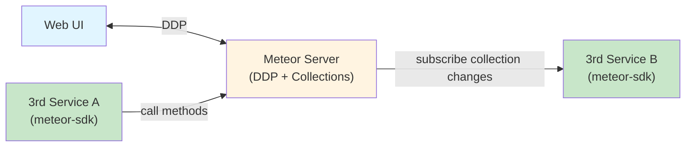
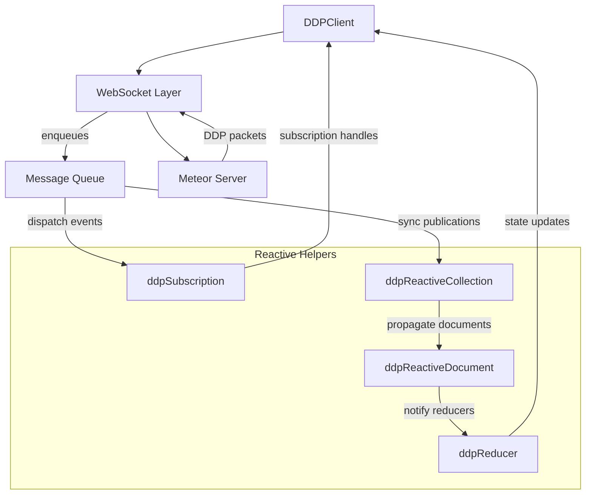

# Introduction

### Overview

Have you ever found yourself in a situation where you needed to call your Meteor application server without going through the UI? Perhaps you wanted to trigger a method from a cron job, process background tasks, sync data between services, or build a CLI tool that interacts with your Meteor backend. If you've faced this challenge, you know the friction: Meteor's DDP protocol is tightly coupled to the browser-based client, making it awkward to consume from Node.js scripts, serverless functions, or other backend services.

### Purpose of the Article

The meteor-sdk solves exactly this problem. It delivers a modern, standalone DDP client that communicates seamlessly with Meteor servers from any JavaScript runtime—no browser required. Whether you're building background workers, integrating external services, or gradually modernizing your stack, meteor-sdk gives you programmatic access to publications, methods, and reactive collections using the same protocol your UI relies on.

#### Target Audience
This article is aimed at developers who already know Meteor, teams maintaining legacy applications, and engineers looking to consume DDP capabilities from external applications. If you need to interact with your Meteor server beyond the traditional browser client, meteor-sdk provides the bridge you've been looking for.

# Why Use meteor-sdk

### Flexibility

The first question many teams ask is why they should connect to a Meteor server without a browser-based client in the loop. The answer is flexibility: meteor-sdk lets you treat Meteor's DDP protocol as a headless API surface, so you can wire up background jobs, CLI tools, IoT devices, or server-to-server integrations that publish, subscribe, and call methods just as a browser would. That opens the door to hybrid architectures where web, mobile, and backend services all consume the same reactive data streams without duplicating logic.



Compared with generic DDP clients, meteor-sdk provides a battle-tested implementation that mirrors the behavior of the official Meteor client while adding stronger TypeScript support, lifecycle management, and helpers for working with reactive collections. You can get reconnection strategies, message queue handling, and subscription tracking tuned specifically for Meteor semantics, which reduces the boilerplate and edge cases you would otherwise need to solve yourself.

# When meteor-sdk Makes Sense

Meteor projects often need to handle background processing, scheduled jobs, or server-side rendering without loading a full browser stack. By dropping meteor-sdk alongside your backend services, you get native DDP connectivity with a fraction of the footprint of a full Meteor client bundle.

### Microservices

For teams carving up monoliths into Node.js or TypeScript microservices, meteor-sdk provides the connective tissue that keeps publications and methods accessible from the new services. Each microservice can subscribe to its slice of the data graph, react to changes, and push updates back into the Meteor universe while still being implemented with modern tooling, linting, and deployment practices.

#### Hybrid and Mobile Apps

Hybrid and mobile applications—built using frameworks like React Native, Capacitor, or Flutter with embedded JavaScript engines—can also benefit. Instead of embedding the entire Meteor runtime in the client, you can use meteor-sdk to negotiate DDP sessions and stream data into the app, letting the UI framework of your choice handle rendering and device-specific capabilities.

### Gradual Migration

Finally, when you're planning a gradual migration away from Meteor's Blaze front-end or legacy build system, meteor-sdk allows you to peel off pieces incrementally. You can keep Meteor handling publications, methods, and accounts while new React, Vue, or Next.js front-ends consume the same data through DDP. This staged approach avoids a big-bang rewrite and lets you validate each new component while the rest of the system keeps running smoothly.

# How meteor-sdk Works

### Architecture

At the heart of meteor-sdk sits `DDPClient`, a fully managed DDP implementation that takes care of WebSocket connectivity, message serialization, and reconnection strategies. Incoming packets flow through an internal message queue before they reach higher-level helpers such as reactive collections or subscription managers, keeping network I/O decoupled from your application logic.



The connection flow mirrors the official Meteor client: `DDPClient` performs the handshake, negotiates protocol versions, and can authenticate using tokens or credentials. Once the session is live, it manages subscriptions, methods, and reactive updates while handling retries and exponential backoff under the hood.


# Getting Started in Practice

The fastest route combines a modern Node.js runtime (18 or 20 LTS for native `fetch`, `WebSocket`, and top-level `await`), TypeScript for type safety, and a bundler or runner that suits your environment. 

// The steps below assume npm, but the same commands translate to pnpm or yarn.

### Set up the toolchain

```bash
mkdir meteor-sdk-demo && cd meteor-sdk-demo
npm init -y
npm install meteor-sdk
npm install -D typescript ts-node @types/node
npx tsc --init --module esnext --target es2022 --moduleResolution node16
```

Update your `package.json` with handy scripts so you can run examples quickly:

```json
{
	"type": "module",
	"scripts": {
		"dev": "ts-node src/index.ts",
		"build": "tsc -p ."
	}
}
```

If you prefer bundlers like Vite or esbuild for browser or hybrid targets, meteor-sdk works out of the box—just ensure the WebSocket polyfill is available in environments without a native implementation (for example, using `ws` on Node.js <18).

### Bootstrap the client

Create `src/index.ts` and wire up a basic connection. The snippet below shows how to configure automatic reconnection, authenticate with either a password or resume token, and call a method.

```ts
import { DDPClient } from 'meteor-sdk';

async function main() {
	const client = new DDPClient({
		endpoint: process.env.METEOR_WS ?? 'wss://app.example.com/websocket',
		autoReconnect: true,
		reconnectInterval: 2_000,
	});

	await client.connect();
	console.log('DDP handshake complete');

	if (process.env.METEOR_TOKEN) {
		await client.loginWithToken(process.env.METEOR_TOKEN);
	} else {
		await client.login({
			user: { email: 'dev@example.com' },
			password: 'hunter2',
		});
	}

	const { result } = await client.call('todos.insert', [{ title: 'Ship meteor-sdk post' }]);
	console.log('Inserted todo id:', result);
}

main().catch((err) => {
	console.error('meteor-sdk demo failed', err);
	process.exitCode = 1;
});
```
 

### Subscribe and react immediately

Once connected, subscriptions expose a `subsReady` promise while reactive collections keep an in-memory view synchronized with the server. You can add the following to `main` to observe live updates:

```ts
import { ddpReactiveCollection } from 'meteor-sdk/classes/ddpReactiveCollection';

async function main() {
	// ... connection and login from previous snippet

	const todos = ddpReactiveCollection(client, 'todos', {
		publication: 'todos.all',
	});

	const stop = todos.onChange(({ added, changed, removed }) => {
		added.forEach((doc) => console.log('[added]', doc._id, doc.title));
		changed.forEach((doc) => console.log('[changed]', doc._id, doc.title));
		removed.forEach((id) => console.log('[removed]', id));
	});

	await todos.subscribe();

	console.log('Initial documents:', todos.toArray());

	await client.call('todos.insert', [{ title: 'Triggered by subscription demo' }]);

	setTimeout(async () => {
		stop();
		await todos.unsubscribe();
		await client.close();
	}, 5_000);
}
```

`ddpReactiveCollection` tracks additions, modifications, and removals using the same diffing strategy as Meteor's original MiniMongo, so downstream consumers receive only the changes they need. For leaner use cases you can skip the helper and inspect raw collections stored in `client.collections`, which are standard `Map` instances keyed by document `_id`.

### Integrate with your stack

- Background workers: use the same client in cron jobs or queue processors to call Meteor methods without building custom REST endpoints.
- Server-rendered or hybrid apps: share the connected client across HTTP handlers (Next.js, Remix) to prefetch publications before rendering.
- Testing harnesses: spin up meteor-sdk inside integration tests to seed data or assert subscription behavior without booting a full browser harness.

Whichever path you choose, the immediate payoff is access to subscriptions, method calls, and publications with near-zero boilerplate. From there, layering advanced helpers, caching, or custom logging becomes incremental work instead of a ground-up rewrite.

# Exploring Advanced Capabilities

meteor-sdk ships with primitives you can compose into richer data flows, background processors, and UI integrations. The sections below highlight patterns that stretch beyond the basic connect-and-call setup.

### Reactive collections with lightweight caching

`ddpReactiveCollection` keeps an in-memory mirror of a publication, which you can hydrate from a persistent cache to support offline-first or low-latency scenarios. The example below demonstrates seeding from disk and writing back deltas as they arrive.

```ts
import { promises as fs } from 'node:fs';
import { ddpReactiveCollection } from 'meteor-sdk/classes/ddpReactiveCollection';

async function bootTodos(client: DDPClient) {
	const todos = ddpReactiveCollection(client, 'todos', {
		publication: 'todos.all',
	});

	try {
		const cached = JSON.parse(await fs.readFile('.cache/todos.json', 'utf8'));
		cached.forEach((doc: any) => todos.inject(doc));
	} catch (err) {
		if ((err as NodeJS.ErrnoException).code !== 'ENOENT') throw err;
	}

	const stop = todos.onChange(async ({ added, changed, removed }) => {
		if (added.length || changed.length || removed.length) {
			await fs.mkdir('.cache', { recursive: true });
			await fs.writeFile('.cache/todos.json', JSON.stringify(todos.toArray()));
		}
	});

	await todos.subscribe();
	return { todos, stop };
}
```

The helper's `inject` method lets you hydrate the local collection before the network subscription becomes ready, giving consumers immediate access to cached data while they wait for fresh updates.

### Shaping data with custom reducers

Reducers turn raw DDP documents into domain-specific projections. `ddpReducer` receives mutation events and can emit derived state (aggregates, denormalized records, metrics) that your application consumes.

```ts
import { ddpReducer } from 'meteor-sdk/classes/ddpReducer';

const statsReducer = ddpReducer(client, 'todos.stats', {
	watch: 'todos',
	initial: { open: 0, completed: 0 },
	reduce(state, event) {
		switch (event.type) {
			case 'added':
				return {
					...state,
					open: state.open + (event.doc.completed ? 0 : 1),
					completed: state.completed + (event.doc.completed ? 1 : 0),
				};
			case 'changed':
				if (event.doc.completed === event.prevDoc?.completed) return state;
				return {
					...state,
					open: state.open + (event.doc.completed ? -1 : 1),
					completed: state.completed + (event.doc.completed ? 1 : -1),
				};
			case 'removed':
				return {
					...state,
					open: state.open - (event.prevDoc.completed ? 0 : 1),
					completed: state.completed - (event.prevDoc.completed ? 1 : 0),
				};
			default:
				return state;
		}
	},
});

statsReducer.onChange((state) => {
	console.log('Todo metrics updated', state);
});
```

Reducers shine when you need to maintain aggregate dashboards, drive analytics events, or expose smaller DTOs to front-end clients without recalculating on each render.

### Events and listeners for real-time reactions

When you only need to react to specific DDP messages—without holding an entire collection in memory—`ddpEventListener` gives you a low-level tap into the event stream. You can register listeners that respond to adds, changes, or removes and trigger side effects such as notifications or webhook calls.

```ts
import { ddpEventListener } from 'meteor-sdk/classes/ddpEventListener';

const listener = ddpEventListener(client, 'todos');

listener.on('added', ({ doc }) => {
	if (doc.priority === 'high') {
		queueNotification(doc.ownerId, `High priority task added: ${doc.title}`);
	}
});

listener.on('changed', ({ doc, prevDoc }) => {
	if (!prevDoc?.completed && doc.completed) {
		emitAnalytics('todo_completed', { id: doc._id });
	}
});

listener.attach();
```

Because listeners operate on raw DDP payloads, they are ideal for background services that translate Meteor events into external systems like message queues, email providers, or monitoring pipelines.

### Framework integrations (React, Vue, Svelte)

meteor-sdk stays agnostic about UI layers, but the reactive helpers fit naturally into modern frameworks.

- **React**: wrap collections in hooks to keep components in sync.

	```ts
	import { useEffect, useMemo, useSyncExternalStore } from 'react';

	export function useTodos(client: DDPClient) {
		const collection = useMemo(
			() => ddpReactiveCollection(client, 'todos', { publication: 'todos.all' }),
			[client],
		);

		useEffect(() => {
			collection.subscribe();
			return () => collection.unsubscribe();
		}, [collection]);

		return useSyncExternalStore(
			(notify) => collection.onChange(() => notify()),
			() => collection.toArray(),
		);
	}
	```

- **Vue**: leverage the Composition API to expose reactivity.

	```ts
	import { ref, onMounted, onBeforeUnmount } from 'vue';

	export function useTodos(client: DDPClient) {
		const docs = ref([]);
		const collection = ddpReactiveCollection(client, 'todos', { publication: 'todos.all' });

		let stop: () => void = () => undefined;

		onMounted(async () => {
			stop = collection.onChange(() => {
				docs.value = collection.toArray();
			});
			await collection.subscribe();
		});

		onBeforeUnmount(async () => {
			stop();
			await collection.unsubscribe();
		});

		return { docs };
	}
	```

- **Svelte**: bridge to stores for idiomatic usage.

	```ts
	import { readable } from 'svelte/store';

	export function todosStore(client: DDPClient) {
		const collection = ddpReactiveCollection(client, 'todos', { publication: 'todos.all' });

		return readable([], (set) => {
			let active = true;

			const stop = collection.onChange(() => {
				if (active) set(collection.toArray());
			});

			collection.subscribe();

			return async () => {
				active = false;
				stop();
				await collection.unsubscribe();
			};
		});
	}
	```

These integrations mirror the event-driven core of meteor-sdk while letting each framework handle rendering, suspense, or transition mechanics. With small adapters like these, you can embed DDP-driven reactivity into widely adopted front-end stacks without reinventing state management.

# Limitations and Watchpoints

While meteor-sdk smooths out many friction points, it is not a silver bullet. Planning around the following constraints will save time later on.

- **Not a full-stack replacement**: meteor-sdk focuses on the client side of DDP. It will not stand up publications, methods, or business logic for you. You still need a maintained Meteor server—or an equivalent DDP-speaking backend—to expose data, enforce security rules, and run validation.
- **Latency-sensitive by design**: DDP is chatty. In high-latency or unstable networks, reconnection loops and subscription churn can introduce visible lag. Tuning `autoReconnect`, batching method calls, or coalescing reducers helps, but if your environment requires strict SLAs, consider colocating services or fronting DDP with a connection manager.
- **Schema management external to Meteor**: once you consume Meteor data outside its traditional context, you become responsible for validating payloads, enforcing schemas, and preventing drift. Libraries like `zod` or `io-ts` pair well with meteor-sdk to assert shapes before data flows deeper into your system.

Understanding these boundaries lets you make conscious trade-offs, whether you double down on Meteor for core services or use meteor-sdk as part of a gradual modernization strategy.

# Conclusion

meteor-sdk keeps the best parts of Meteor—reactive data, battle-tested DDP semantics—available to modern stacks without forcing a monolithic runtime. It delivers seamless connectivity, strong TypeScript support, and a suite of helpers that simplify everything from background jobs to UI integrations.

To go deeper, explore the official documentation, browse the example projects in the repository, or join community channels where teams share deployment patterns and migration stories. The quickest win is to clone the demo setup above, point it at your Meteor instance, and experiment with live data.

Try the SDK in a small service, contribute fixes or enhancements if you spot gaps, and share the results with the community. The more feedback and real-world stories surface, the stronger the ecosystem becomes for everyone still betting on Meteor's unique capabilities.
