# Introduction

### Overview

Have you ever found yourself in a situation where you needed to call your Meteor application server without going through the UI? Perhaps you wanted to trigger a method from a cron job, process background tasks, sync data between services, or build a CLI tool that interacts with your Meteor backend. If you've faced this challenge, you know the friction: Meteor's DDP protocol is tightly coupled to the browser-based client, making it awkward to consume from Node.js scripts, serverless functions, or other backend services.

### Purpose of the Article

This guide shows how to call your Meteor server from Node.js using a headless DDP client (SimpleDDP). You'll connect over WebSocket, call methods, derive deltas, and compute stats—without a browser. All runnable examples used here are available as separate scripts in the repository below:

- App repository (with the tutorial scripts under `tutorial/`): https://github.com/italojs/posting

#### Target Audience
This article is aimed at developers who already know Meteor, teams maintaining legacy applications, and engineers looking to consume DDP capabilities from external applications. If you need to interact with your Meteor server beyond the traditional browser client, meteor-sdk provides the bridge you've been looking for.

# Why Use meteor-sdk

### Flexibility

The first question many teams ask is why they should connect to a Meteor server without a browser-based client in the loop. The answer is flexibility: meteor-sdk lets you treat Meteor's DDP protocol as a headless API surface, so you can wire up background jobs, CLI tools, IoT devices, or server-to-server integrations that publish, subscribe, and call methods just as a browser would. That opens the door to hybrid architectures where web, mobile, and backend services all consume the same reactive data streams without duplicating logic.


Compared with generic DDP clients, meteor-sdk provides a battle-tested implementation that mirrors the behavior of the official Meteor client while adding stronger TypeScript support, lifecycle management, and helpers for working with reactive collections. You can get reconnection strategies, message queue handling, and subscription tracking tuned specifically for Meteor semantics, which reduces the boilerplate and edge cases you would otherwise need to solve yourself.

# When meteor-sdk Makes Sense

Meteor projects often need to handle background processing, scheduled jobs, or server-side rendering without loading a full browser stack. By dropping meteor-sdk alongside your backend services, you get native DDP connectivity with a fraction of the footprint of a full Meteor client bundle.

### Microservices

For teams carving up monoliths into Node.js or TypeScript microservices, meteor-sdk provides the connective tissue that keeps publications and methods accessible from the new services. Each microservice can subscribe to its slice of the data graph, react to changes, and push updates back into the Meteor universe while still being implemented with modern tooling, linting, and deployment practices.

#### Hybrid and Mobile Apps

Hybrid and mobile applications—built using frameworks like React Native, Capacitor, or Flutter with embedded JavaScript engines—can also benefit. Instead of embedding the entire Meteor runtime in the client, you can use meteor-sdk to negotiate DDP sessions and stream data into the app, letting the UI framework of your choice handle rendering and device-specific capabilities.

### Gradual Migration

Finally, when you're planning a gradual migration away from Meteor's Blaze front-end or legacy build system, meteor-sdk allows you to peel off pieces incrementally. You can keep Meteor handling publications, methods, and accounts while new React, Vue, or Next.js front-ends consume the same data through DDP. This staged approach avoids a big-bang rewrite and lets you validate each new component while the rest of the system keeps running smoothly.

# How meteor-sdk Works

### Architecture

At the heart of meteor-sdk sits `DDPClient`, a fully managed DDP implementation that takes care of WebSocket connectivity, message serialization, and reconnection strategies. Incoming packets flow through an internal message queue before they reach higher-level helpers such as reactive collections or subscription managers, keeping network I/O decoupled from your application logic.

```mermaid
flowchart TD
		Client["DDPClient"]
		Socket["WebSocket Layer"]
		Queue["Message Queue"]
		subgraph Helpers["Reactive Helpers"]
				Sub["ddpSubscription"]
				Coll["ddpReactiveCollection"]
				Doc["ddpReactiveDocument"]
				Reducer["ddpReducer"]
		end
		Meteor["Meteor Server"]

		Client --> Socket
		Socket --> Meteor
		Meteor -->|"DDP packets"| Socket
		Socket -->|"enqueues"| Queue
		Queue -->|"dispatch events"| Sub
		Queue -->|"sync publications"| Coll
		Coll -->|"propagate documents"| Doc
		Doc -->|"notify reducers"| Reducer
		Reducer -->|"state updates"| Client
		Sub -->|"subscription handles"| Client
```



The connection flow mirrors the official Meteor client: `DDPClient` performs the handshake, negotiates protocol versions, and can authenticate using tokens or credentials. Once the session is live, it manages subscriptions, methods, and reactive updates while handling retries and exponential backoff under the hood.


# Getting Started in Practice

The fastest route combines a modern Node.js runtime (18 or 20 LTS for native `fetch`, `WebSocket`, and top-level `await`), TypeScript for type safety, and a bundler or runner that suits your environment. 

// The steps below assume npm, but the same commands translate to pnpm or yarn.

### Set up the toolchain

```bash
mkdir ddp-demo && cd ddp-demo
npm init -y
npm install simpleddp isomorphic-ws dotenv
npm install -D typescript ts-node @types/node
npx tsc --init --module Node16 --target es2022 --moduleResolution node16
```

Update your `package.json` with handy scripts so you can run examples quickly:

```json
{
	"type": "module",
	"scripts": {
		"dev": "ts-node src/index.ts",
		"build": "tsc -p ."
	}
}
```

If you prefer bundlers like Vite or esbuild for browser or hybrid targets, SimpleDDP works out of the box—just ensure a WebSocket polyfill is available in environments without a native implementation.

### Bootstrap the client

Create two files—`src/ddpClient.ts` and `src/index.ts`—to configure a SimpleDDP client, optionally authenticate, and call a method exposed by your Meteor app.

`src/ddpClient.ts`

```ts
import SimpleDDP from 'simpleddp';
import type { SimpleDDPOptions } from 'simpleddp';
import ws from 'isomorphic-ws';

export function createDDPClient(endpoint: string, extra?: Partial<SimpleDDPOptions>) {
	const opts: SimpleDDPOptions = {
		endpoint,
		SocketConstructor: ws as any,
		autoReconnect: true,
		reconnectInterval: 2000,
		...extra,
	} as any;
	return new SimpleDDP(opts);
}
```

`src/index.ts`

```ts
import 'dotenv/config';
import { createDDPClient } from './ddpClient';
import crypto from 'node:crypto';

async function main() {
	const endpoint = process.env.METEOR_WS || 'ws://localhost:8080/websocket';
	const client = createDDPClient(endpoint);

	await client.connect();
	console.log('DDP connected');

	if (process.env.METEOR_TOKEN) {
		await client.call('login', { resume: process.env.METEOR_TOKEN });
	} else if (process.env.METEOR_EMAIL && process.env.METEOR_PASSWORD) {
		const digest = crypto.createHash('sha256').update(process.env.METEOR_PASSWORD).digest('hex');
		await client.call('login', {
			user: { email: process.env.METEOR_EMAIL },
			password: { digest, algorithm: 'sha-256' },
		});
	}

	const res = await client.call('get.contents.fetchRss', { urls: ['https://hnrss.org/frontpage'] });
	console.log('RSS items:', (res as any)?.items?.length ?? 0);

	await client.disconnect();
}

main().catch((err) => {
	console.error('bootstrap failed', err);
	process.exit(1);
});
```
 

### React immediately (polling-based)

If your app doesn't expose publications, you can still react to data by polling a method and diffing results between cycles. The snippet below fetches RSS items periodically and prints added/changed/removed entries.

```ts
import 'dotenv/config';
import { createDDPClient } from './ddpClient';

function keyOf(it: any) {
	return it?.id || it?.guid || it?.link || it?.url || `${it?.title ?? ''}|${it?.pubDate ?? it?.date ?? ''}`;
}

function indexByKey(items: any[]) {
	const m = new Map<string, any>();
	for (const it of items || []) m.set(keyOf(it), it);
	return m;
}

function shallowEqual(a: any, b: any) {
	if (!a || !b) return a === b;
	const ak = Object.keys(a), bk = Object.keys(b);
	if (ak.length !== bk.length) return false;
	return ak.every((k) => a[k] === b[k]);
}

async function main() {
	const client = createDDPClient(process.env.METEOR_WS || 'ws://localhost:8080/websocket');
	await client.connect();

	let prev: any[] = [];
	const urls = ['https://hnrss.org/frontpage'];

	const tick = async () => {
		const res = await client.call('get.contents.fetchRss', { urls });
		const fresh: any[] = (res as any)?.items ?? [];
		const prevIndex = indexByKey(prev), freshIndex = indexByKey(fresh);
		const added: any[] = [], changed: any[] = [], removed: string[] = [];
		for (const [k, v] of freshIndex) prevIndex.has(k) ? (!shallowEqual(prevIndex.get(k), v) && changed.push(v)) : added.push(v);
		for (const [k] of prevIndex) if (!freshIndex.has(k)) removed.push(k);
		console.log('added:', added.length, 'changed:', changed.length, 'removed:', removed.length);
		prev = fresh;
	};

	await tick();
	const id = setInterval(tick, 5_000);
	setTimeout(async () => { clearInterval(id); await client.disconnect(); }, 15_000);
}

main();
```

### Integrate with your stack

- Background workers: use the same client in cron jobs or queue processors to call Meteor methods without building custom REST endpoints.
- Server-rendered or hybrid apps: share the connected client across HTTP handlers (Next.js, Remix) to prefetch publications before rendering.
- Testing harnesses: spin up meteor-sdk inside integration tests to seed data or assert subscription behavior without booting a full browser harness.

Whichever path you choose, the immediate payoff is access to subscriptions, method calls, and publications with near-zero boilerplate. From there, layering advanced helpers, caching, or custom logging becomes incremental work instead of a ground-up rewrite.

# Exploring Advanced Capabilities

meteor-sdk ships with primitives you can compose into richer data flows, background processors, and UI integrations. The sections below highlight patterns that stretch beyond the basic connect-and-call setup.

### Lightweight caching with file snapshot

Persist a snapshot to disk, compute deltas, and write back the new snapshot—useful for quick caches and offline starts.

```ts
import 'dotenv/config';
import { promises as fs } from 'node:fs';
import path from 'node:path';
import { createDDPClient } from './ddpClient';

const CACHE_DIR = path.resolve('.cache');
const CACHE_FILE = path.join(CACHE_DIR, 'rss.json');

function keyOf(it: any) { return it?.id || it?.guid || it?.link || it?.url || `${it?.title ?? ''}|${it?.pubDate ?? it?.date ?? ''}`; }
function indexByKey(items: any[]) { const m = new Map<string, any>(); for (const it of items||[]) m.set(keyOf(it), it); return m; }
function shallowEqual(a: any, b: any) { if (!a||!b) return a===b; const ak=Object.keys(a),bk=Object.keys(b); if(ak.length!==bk.length) return false; return ak.every(k=>a[k]===b[k]); }

async function loadCache() { try { return JSON.parse(await fs.readFile(CACHE_FILE, 'utf8')); } catch (e: any) { if (e.code==='ENOENT') return []; throw e; } }
async function saveCache(items: any[]) { await fs.mkdir(CACHE_DIR, { recursive: true }); await fs.writeFile(CACHE_FILE, JSON.stringify(items, null, 2)); }

async function main() {
  const client = createDDPClient(process.env.METEOR_WS || 'ws://localhost:8080/websocket');
  await client.connect();
  const previous = await loadCache();
  const res = await client.call('get.contents.fetchRss', { urls: ['https://hnrss.org/frontpage'] });
  const fresh: any[] = (res as any)?.items ?? [];
  const prevIndex = indexByKey(previous), freshIndex = indexByKey(fresh);
  const added: any[] = [], changed: any[] = [], removed: string[] = [];
  for (const [k, v] of freshIndex) prevIndex.has(k) ? (!shallowEqual(prevIndex.get(k), v) && changed.push(v)) : added.push(v);
  for (const [k] of prevIndex) if (!freshIndex.has(k)) removed.push(k);
  console.log('delta -> added:', added.length, 'changed:', changed.length, 'removed:', removed.length);
  await saveCache(fresh);
}

main();
```

### Shaping data with a simple reducer

Derive aggregated stats (contagens e último item) a partir do snapshot atual e do delta calculado.

```ts
type Item = { title?: string; link?: string; url?: string; pubDate?: string|number; date?: string|number; guid?: string; id?: string } & Record<string, any>;
type Delta = { added: Item[]; changed: Item[]; removed: string[] };

function domainOf(item: Item): string | null {
  const url = item.link || item.url; if (!url) return null; try { return new URL(url).hostname.replace(/^www\./,''); } catch { return null; }
}

function deriveStats(fromItems: Item[], delta: Delta) {
  const byDomain: Record<string, number> = {};
  let latest: number | null = null;
  for (const it of fromItems) {
    const d = domainOf(it); if (d) byDomain[d] = (byDomain[d] || 0) + 1;
    const ts = Date.parse((it.pubDate as any) ?? (it.date as any) ?? '') || null;
    if (typeof ts === 'number') { if (latest == null || ts > latest) latest = ts; }
  }
  return {
    total: fromItems.length,
    latest: latest ? new Date(latest).toISOString() : null,
    byDomain,
    counts: { added: delta.added.length, changed: delta.changed.length, removed: delta.removed.length },
  };
}
```

### Event-like listeners (polling + diff)

Sem publicações, você pode obter um efeito semelhante a listeners fazendo polling e emitindo eventos derivados do delta:

```ts
const urls = ['https://hnrss.org/frontpage'];
let previous: any[] = [];
const periodMs = 5000;

async function cycle(client: any) {
  const result = await client.call('get.contents.fetchRss', { urls });
  const fresh: any[] = (result as any)?.items ?? [];
  // compute delta (added/changed/removed) e acione efeitos colaterais
  previous = fresh;
}

setInterval(() => cycle(client), periodMs);
```

### Framework integrations (React, Vue, Svelte)

meteor-sdk stays agnostic about UI layers, but the reactive helpers fit naturally into modern frameworks.

- **React**: wrap collections in hooks to keep components in sync.

	```ts
	import { useEffect, useMemo, useSyncExternalStore } from 'react';

	export function useTodos(client: DDPClient) {
		const collection = useMemo(
			() => ddpReactiveCollection(client, 'todos', { publication: 'todos.all' }),
			[client],
		);

		useEffect(() => {
			collection.subscribe();
			return () => collection.unsubscribe();
		}, [collection]);

		return useSyncExternalStore(
			(notify) => collection.onChange(() => notify()),
			() => collection.toArray(),
		);
	}
	```

- **Vue**: leverage the Composition API to expose reactivity.

	```ts
	import { ref, onMounted, onBeforeUnmount } from 'vue';

	export function useTodos(client: DDPClient) {
		const docs = ref([]);
		const collection = ddpReactiveCollection(client, 'todos', { publication: 'todos.all' });

		let stop: () => void = () => undefined;

		onMounted(async () => {
			stop = collection.onChange(() => {
				docs.value = collection.toArray();
			});
			await collection.subscribe();
		});

		onBeforeUnmount(async () => {
			stop();
			await collection.unsubscribe();
		});

		return { docs };
	}
	```

- **Svelte**: bridge to stores for idiomatic usage.

	```ts
	import { readable } from 'svelte/store';

	export function todosStore(client: DDPClient) {
		const collection = ddpReactiveCollection(client, 'todos', { publication: 'todos.all' });

		return readable([], (set) => {
			let active = true;

			const stop = collection.onChange(() => {
				if (active) set(collection.toArray());
			});

			collection.subscribe();

			return async () => {
				active = false;
				stop();
				await collection.unsubscribe();
			};
		});
	}
	```

These integrations mirror the event-driven core of meteor-sdk while letting each framework handle rendering, suspense, or transition mechanics. With small adapters like these, you can embed DDP-driven reactivity into widely adopted front-end stacks without reinventing state management.

# Limitations and Watchpoints

While meteor-sdk smooths out many friction points, it is not a silver bullet. Planning around the following constraints will save time later on.

- **Not a full-stack replacement**: meteor-sdk focuses on the client side of DDP. It will not stand up publications, methods, or business logic for you. You still need a maintained Meteor server—or an equivalent DDP-speaking backend—to expose data, enforce security rules, and run validation.
- **Latency-sensitive by design**: DDP is chatty. In high-latency or unstable networks, reconnection loops and subscription churn can introduce visible lag. Tuning `autoReconnect`, batching method calls, or coalescing reducers helps, but if your environment requires strict SLAs, consider colocating services or fronting DDP with a connection manager.
- **Schema management external to Meteor**: once you consume Meteor data outside its traditional context, you become responsible for validating payloads, enforcing schemas, and preventing drift. Libraries like `zod` or `io-ts` pair well with meteor-sdk to assert shapes before data flows deeper into your system.

Understanding these boundaries lets you make conscious trade-offs, whether you double down on Meteor for core services or use meteor-sdk as part of a gradual modernization strategy.

# Conclusion

Usando SimpleDDP você acessa métodos e dados do seu Meteor sem precisar do cliente do navegador, com Node.js + TypeScript e scripts enxutos. Os exemplos completos e executáveis deste tutorial estão no repositório do app posting:

- https://github.com/italojs/posting (veja a pasta `tutorial/`)

Clone, ajuste a variável `METEOR_WS` para o seu endpoint (ex.: `ws://localhost:8080/websocket`), e execute cada demo de forma independente para validar no seu ambiente.
